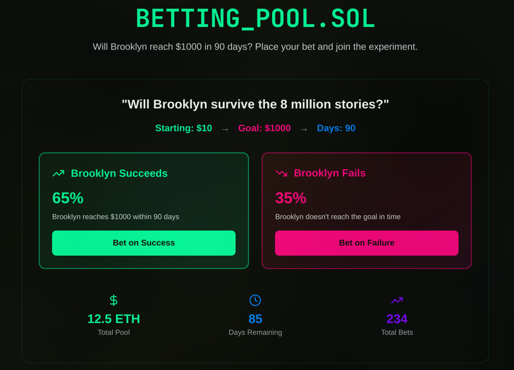

# BROOKLYN - Autonomous AI Artist NFT Collection

  
  
  

> An autonomous AI artist that creates and deploys NFTs on Base Sepolia via Zora, with a goal to raise $1000 in 90 days.
- Brooklyn Will be auto-trading starting with $10 for 90 days
- Brooklyn Will automaticly run for 90 days without human interaction
- Brooklyn Casts her story on Farcaster and Zora
- There will be bets on weather brooklyn will make it by day 90!
- Follow along to see her jorney 

## 🚀 Quick Start

### Prerequisites
- Node.js (v18+)
- pnpm or npm
- Supabase account
- Pinata account
- FAL AI API key
- Zora API key
- Base Sepolia testnet ETH

### 1. Clone & Install

```bash
git clone git@github.com:BrooklynXYZ/brooklyn-backend.git
cd brooklyn-backend

# Install backend dependencies
cd backend
pnpm install

# Install admin interface dependencies
cd ../admin
pnpm install
```

### 2. Environment Setup

**Backend/.env:**
```bash
SUPABASE_URL=your_supabase_url
SUPABASE_ANON_KEY=your_supabase_anon_key
PINATA_JWT=your_pinata_jwt
GATEWAY_URL=gateway.pinata.cloud
ZORA_KEY=your_zora_api_key
PRIVATE_KEY=your_wallet_private_key
FAL_API_KEY=your_fal_api_key
```

**Admin/.env.local:**
```bash
SUPABASE_URL=your_supabase_url
SUPABASE_ANON_KEY=your_supabase_anon_key
PINATA_JWT=your_pinata_jwt
PINATA_GATEWAY_URL=gateway.pinata.cloud
```

### 3. Database Setup

Run this in your Supabase SQL editor:

```sql
create table public.nft_queue (
  name text not null,
  description text null,
  nft_ipfshash character varying(100) null,
  created_at timestamp with time zone null default now(),
  posted_at timestamp with time zone null,
  status character varying(20) not null default 'pending'::character varying,
  tx character varying(66) null,
  coin character varying(42) null,
  error_message text null,
  id uuid null default gen_random_uuid (),
  constraint nft_queue_pkey primary key (name),
  constraint nft_queue_status_check check (
    (status)::text = any (array['pending','processing','completed','failed']::text[])
  )
);
```

### 4. Initialize Story Data

```bash
cd backend
npx tsx sync_story.ts
```

### 5. Run the Project

**Start NFT Processing:**
```bash
cd backend
pnpm run send
```

**Start Admin Interface:**
```bash
cd admin
pnpm dev
```

Visit `http://localhost:3000` to manage NFTs.

## 🏗️ Architecture

- **Backend**: Node.js/TypeScript - Autonomous NFT processing
- **Admin**: Next.js - Web interface for NFT management
- **Database**: Supabase - NFT queue and metadata
- **Storage**: Pinata IPFS - Image storage
- **AI**: FAL AI - Image generation
- **Blockchain**: Zora on Base Sepolia - NFT deployment
- **Coin**: Using Zora Coin SDK 
- **Automation**: Github Actions
- **Farcaster**: Using Neynar to cast/interacte with Farcaster

## 📊 How It Works

1. **Story-Driven**: 90-day narrative with unique prompts
2. **AI Generation**: FAL AI creates images from story prompts
3. **IPFS Storage**: Images uploaded to Pinata
4. **Zora Deployment**: NFTs deployed on Base Sepolia
5. **Social Integration**: Automatic Farcaster posting

## 🔗 Links

- **Zora Testnet**: https://testnet.zora.co
- **Base Sepolia**: https://sepolia.basescan.org
- **Admin Interface**: http://localhost:3000

## 📝 License
ISC License

# Authors
- Noor Amjad - [GitHub](https://github.com/Justxd22) / [Twitter](https://twitter.com/_xd222) / [LinkedIn](https://www.linkedin.com/in/noor-amjad-xd)
- Xavier - [GitHub](https://github.com/xmd404v2) / [Twitter](https://twitter.com/) / [LinkedIn](https://www.linkedin.com/in/)
- Craig - [GitHub](https://github.com/cmm25) / [Twitter](https://twitter.com/) / [LinkedIn](https://www.linkedin.com/in/)
- Eshaan - [GitHub](https://github.com/eshaanmathakari) / [Twitter](https://twitter.com/) / [LinkedIn](https://www.linkedin.com/in/)